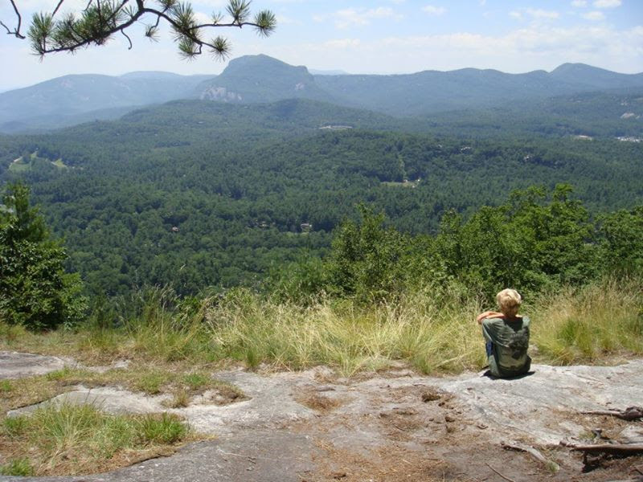

# First Day on the Trail

**Date:** June 1, 2024
**Location:** Mount Rainier National Park
**Miles Hiked:** 8.5

Today marked the beginning of my summer hiking adventure! The weather was perfect - clear skies and a gentle breeze. The trailhead was bustling with other hikers, but the crowds thinned out after the first few miles.

The highlight of the day was reaching the first viewpoint, where we got an incredible view of the mountain. The wildflowers were in full bloom, creating a beautiful contrast against the snow-capped peaks.

## Gear Notes

- New hiking boots performed well
- Need to adjust pack straps for better weight distribution
- Water filter working great

## Wildlife Spotted

- Marmot
- Mountain goat
- Various birds

## Camp Setup

Found a great spot near a small stream. The ground was soft and level, perfect for pitching the tent. The sunset was absolutely stunning!

