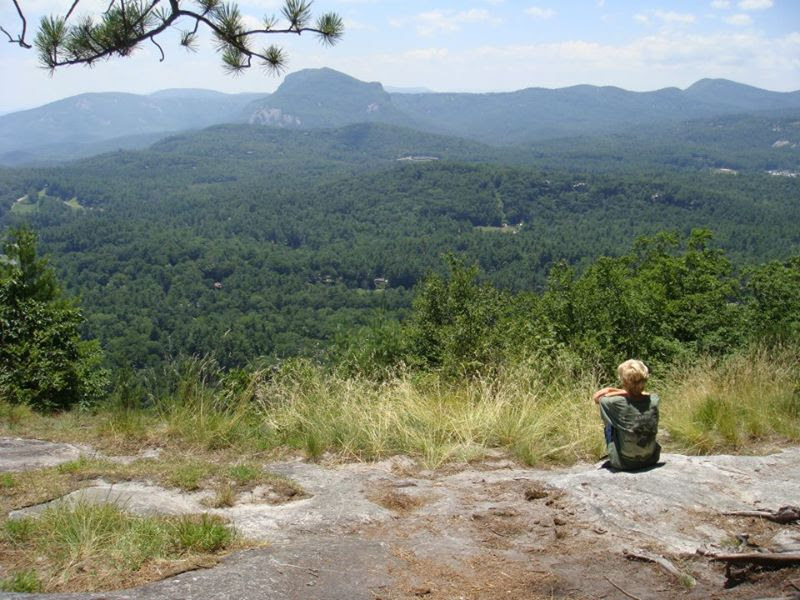

# About

On rainy morning in 2009, my mom, my brother and I set off into the North Carolinean wilderness to find something that we had read was closeby. Something mythic, a gem in the woods: The Appalachian Trail. We had become somewhat intermediate hikers at that time, going from peak to peak around North Carolina. Whiteside Mountian, Rainbow Falls and, ironicly, Amicalola falls would set the backgrop for a liftime of East Coast hiking.

Today though, we were venturing down an unbarked rrail just down the road where we were staging. Apprently, this was a popular connection point for through hikers going through the soggy peaks, passes and valleys of Sapphire. With nothing but word of mouth and trail maker, we pushed back the heavy rhododendron brush to reveal an ill-maked path that went about a mile down the mountian into a creekbed. This trail differed greatly from the flat, earmarked trails we were used to. Just getting from marker to marker because like a game of ISpy.

At a cerain point, we were in between markers, and the markers just dissapeared. We were lost. I had an issue with my blood sugar dropping, and I dragged my feet as we searched for the trail head back out of the pit.

We took a break by the raging stream before heading back up. I squatted with my arms over my knees, and I imagined a thru hiker. I imagined them filling up a bottle from the stream and filtering it to drink. I imaged putting down my backpack, laying in the middle of the trail, and pitching a tent with a few of the stream, and waiting for night to come, just to pick up and keep going the following day.

This image has lingered in my mind in some form or another for the last 15 years. I still share that feeling of contentment that I did as a young child in the Appalachian woods. They will always have a familiarity to them. And though they remain agnostic to me, I miss them every time I leave, and hope that not too much time passes before I am able to hike again.

It's not hard to see now, as a man in his twenties with a desk job, what would be so appealing about the trail. It provides a simpleness, an absolute goal and an ample challenge. As for everything else, well, I'm not so sure.

I created this website to log my journey on the trail, though it is far from garunteed. An ankle twist on day two could put a damper on things entirely, and though I approach the trail with a great excitement, I will do my best to accept that there are some thigns out of my control.

Hopefully, that alone will be a sufficient moral, but I promise I will be extra careful.

I will spend the next 5 weeks hiking the trail, should nature allow. I will sleep on the ground. I will eat a bunch of freeze dried provisions, And yes, I will poop in a hole in the ground which I dug myself. I will say goodbye to the comforts that I work so hard for, that I cling so hard to. And I will rely on my own exhaustion to keep me asleep at night. Or so I hope.

To say that I am able to on this trip because of the support of my friends, peers and family would be an understatement. I am so lucky to have people in my life who, though they may not understand it, encourage my dream. So if you are a friend, or someone I don't even know, I keep this log as a gift to you-- to inspire you to dream, to persue, and most importantly, to wander.

William

